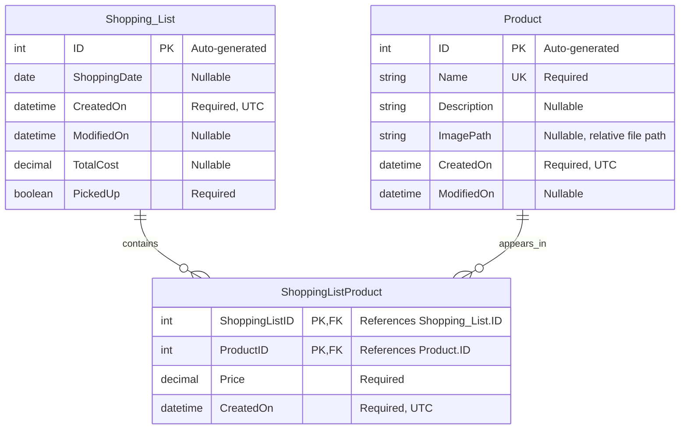

# shopping-app

## Database structure

The app stores its data locally in `shopping.db3`, in the device's app data directory. A shopping list can contain many products, and a product can appear in many shopping lists. `ShoppingListProduct` links them and records the price for each product in that list.

### Entity relationship diagram

The diagram uses logical types; SQLite storage details are noted below.

### Product

Catalog of products available to add to shopping lists.

| Column | Logical type | Nullable | Rules |
| --- | --- | --- | --- |
| `ID` | Integer | No | Auto-generated primary key. |
| `Name` | String | No | Unique; comparison is case-sensitive. The insertion method trims names and rejects blank values. |
| `Description` | String | Yes | Optional description. |
| `ImagePath` | String | Yes | Optional relative path to one product picture, such as `products/green-apples.jpg`. |
| `CreatedOn` | DateTime | No | Set to UTC by the app's insertion method. |
| `ModifiedOn` | DateTime | Yes | Initially null; update logic is not implemented yet. |

#### Product pictures

The model supports one optional picture reference per product. `ImagePath` stores the relative file path, not the image itself. A null value means no picture is assigned.

The planned picture workflow will:

- Store pictures in a `products` subfolder inside the app's private, persistent data directory on the user's phone.
- Base filenames on the product name, removing invalid filename characters and handling naming conflicts.
- Save the relative path in `ImagePath`.
- Resolve that path against `FileSystem.AppDataDirectory` when displaying the picture.
- Allow a new picture to replace the product's existing picture.

Only the database field is implemented so far. Photo selection, file storage, display, and replacement logic are not implemented yet.

### Shopping_List

A shopping list with an optional shopping date and total cost.

| Column | Logical type | Nullable | Rules |
| --- | --- | --- | --- |
| `ID` | Integer | No | Auto-generated primary key. |
| `ShoppingDate` | Date | Yes | Calendar date only, with no time component. |
| `CreatedOn` | DateTime | No | Set to UTC by the app's insertion method. |
| `ModifiedOn` | DateTime | Yes | Initially null; update logic is not implemented yet. |
| `TotalCost` | Decimal currency | Yes | Amount with at most two decimal places. Not automatically calculated from linked product prices yet. |
| `PickedUp` | Boolean | No | Defaults to `false` in the app. |

### ShoppingListProduct

Links an existing product to an existing shopping list, with its price for that list.

| Column | Logical type | Nullable | Rules |
| --- | --- | --- | --- |
| `ShoppingListID` | Integer | No | Part of the composite primary key; foreign key to `Shopping_List.ID`. |
| `ProductID` | Integer | No | Part of the composite primary key; foreign key to `Product.ID`. |
| `Price` | Decimal currency | No | Amount with at most two decimal places. |
| `CreatedOn` | DateTime | No | Set to UTC by the app's insertion method. |

The primary key is `(ShoppingListID, ProductID)`, so a product can appear only once per shopping list. No separate ID column is needed. The same product can have different prices in different lists.

Both foreign keys use `ON DELETE RESTRICT` and `ON UPDATE RESTRICT`: linked entries must be removed before deleting a referenced parent, and referenced parent IDs cannot be changed while links exist. An additional index on `ProductID` supports lookups and foreign-key checks.

### SQLite storage details

- `Price` and `TotalCost` are stored as integer cents (for example, `12.34` becomes `1234`) and exposed as `decimal` values in C#. The model setters reject amounts with more than two decimal places.
- `ShoppingDate` is stored as `yyyy-MM-dd` text and exposed as `DateOnly?` in C#.
- `ImagePath` is stored as nullable text. Image files are intended to live separately in the app's private storage.
- DateTime values are stored as .NET ticks. Insertion methods populate `CreatedOn` using `DateTime.UtcNow`; this is application behavior, not a database default or trigger.
- `PickedUp` is stored as `0` or `1`. Its initial `false` value is supplied by the app, not a database default.
- Date and currency convenience properties marked `[Ignore]` do not create extra columns.
- Tables are initialized on first database access. Foreign-key enforcement is enabled for the shared connection.
- The existing `CreateTableAsync<Product>()` call adds the missing nullable `ImagePath` column when database initialization runs. Existing products initially have no picture path.
- Future changes to existing constraints require schema migrations.